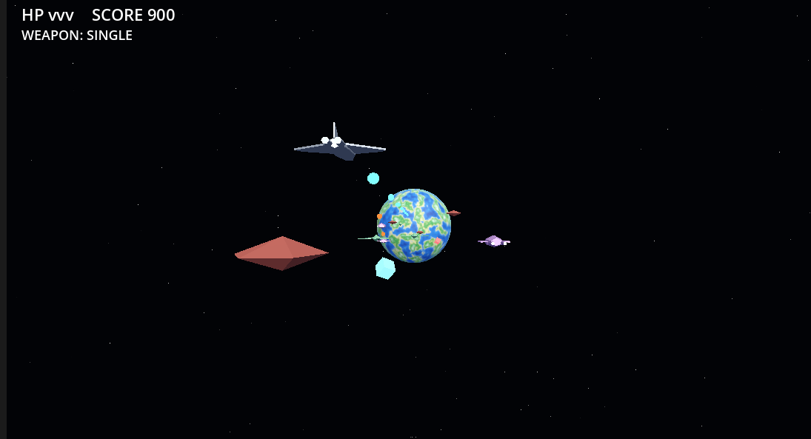

# Space Shooter (Godot × Blender MCP / AIサンプル)



奥にある地球へ向かって進む、1ステージのオンレール宇宙シューティングです。

> **このプロジェクトについて**
> これは **AI（[Claude Code](https://claude.com/claude-code) / Claude Opus）と対話しながら丸ごと作ったサンプルゲーム**です。
> ゲームコード（GDScript）だけでなく、**3Dモデルも AI が [Blender MCP](https://www.blender.org/lab/mcp-server/) 経由で Blender を直接操作して一から作成**しています。
> 技術検証・デモが目的で、製品クオリティを狙ったものではありません。

## 使ったもの

- **Godot 4.6**（Forward+ / D3D12）、GDScript
- **Blender 5.1 + 公式 Blender MCP サーバー** — 自機・敵・ボスのローポリ glb を `bpy`/`bmesh` で生成・エクスポート
  - Blender→glTF の軸変換（Blender +Y → Godot −Z）を踏まえて作り、**Godot側での向き補正が不要**になるよう設計
  - マテリアル・法線も Blender 側で正しく付け、glb のものをそのまま使用
- **godot-mcp** — Godot プロジェクトの実行・デバッグを AI から操作

> 初期の試作では text→image→3D のローカル生成（SD-Turbo + TripoSR）も試しましたが、最終的に Blender での手組みローポリに統一しました。

## 遊び方

Godot 4.6 で本リポジトリを開き、メインシーン `game.tscn` を実行するだけです。

### 操作

| 操作 | キー |
|------|------|
| 移動 | `WASD` または 矢印キー |
| 攻撃 | 自動連射 |
| リトライ | `Enter` / `R`（ゲームオーバー・クリア後） |

道中で出るアイテムを取ると攻撃パターンが切り替わります（single / spread / rapid / wide）。

## 内容

- **敵3種**: drone（回転する機雷）/ shooter（双発砲のガンシップ）/ weaver（蛇行するダート）
- **ボス**: 大型戦艦。HPが減ると弾幕が激化
- **アイテム**で武器パターン変更
- 撃破・被弾時の軽量なヒット演出（フラッシュ＋火花）
- クリアで花火とクリアメッセージ
- 背景の地球・星空はテクスチャ画像なしの**プロシージャル生成**（ノイズ＋スカイシェーダー）

## 構成

```
game.tscn            メインシーン（環境・ライト・カメラ・コンテナのみ）
node_3d.tscn         モデル確認用ビューア（オービットカメラ）
scripts/             player / enemy / bullet / item / boss / game_manager
models/              Blender 製ローポリ glb（自機・敵・ボス）
star_sky.gdshader    星空スカイシェーダー
```

敵・弾・アイテム・ボス・HUD はすべて**コードから生成**しており、エンティティごとの `.tscn` は持ちません。

---

🤖 Built with AI assistance (Claude Code + Blender MCP).
